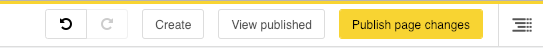

==================
django CMS History
==================

|pypi| |build| |coverage|

**django CMS History** is an addon application to provide undo/redo functionality in `django CMS
<https://django-cms.org/>`_, by maintaining content history.

Some of the functionality in this application was previously included in django CMS itself. However, it became apparent
that some users did not want it, and some wanted functionality that worked differently.

In keeping with the django CMS philosophy of maintaining only core CMS functionality as part of the package itself,
history management was removed from django CMS in version 3.4 and has been spun off into an independent application.

django CMS History has been rewritten from the ground up. It will continue to be developed. New functionality and
improvements will be introduced in future releases.

Contributing
============

This is a an open-source project. We'll be delighted to receive your
feedback in the form of issues and pull requests. Before submitting your
pull request, please review our `contribution guidelines
<http://docs.django-cms.org/en/latest/contributing/index.html>`_.

We're grateful to all contributors who have helped create and maintain this package.
Contributors are listed at the `contributors <https://github.com/divio/djangocms-history/graphs/contributors>`_
section.

One of the easiest contributions you can make is helping to translate this addon on
`Transifex <https://www.transifex.com/projects/p/djangocms-history/>`_.

Documentation
=============

See ``REQUIREMENTS`` in the `setup.py <https://github.com/divio/djangocms-history/blob/master/setup.py>`_
file for additional dependencies:

|python| |django| |djangocms|

Installation
------------

For a manual install:

* run ``pip install djangocms-history``
* add ``djangocms_history`` to your ``INSTALLED_APPS``
* run ``python manage.py migrate djangocms_history``

Configuration
-------------

Once installed, django CMS History will make new options available to the web content manager. These will be visible in
the django CMS toolbar when managing content that is supported by the application.

Running Tests
-------------

You can run tests by executing::

    virtualenv env
    source env/bin/activate
    pip install -r tests/requirements.txt
    python setup.py test

.. |pypi| image:: https://badge.fury.io/py/djangocms-history.svg
    :target: http://badge.fury.io/py/djangocms-history
.. |build| image:: https://travis-ci.org/divio/djangocms-history.svg?branch=master
    :target: https://travis-ci.org/divio/djangocms-history
.. |coverage| image:: https://codecov.io/gh/divio/djangocms-history/branch/master/graph/badge.svg
    :target: https://codecov.io/gh/divio/djangocms-history

.. |python| image:: https://img.shields.io/badge/python-3.5+-blue.svg
    :target: https://pypi.org/project/djangocms-history/
.. |django| image:: https://img.shields.io/badge/django-2.2,%203.0,%203.1-blue.svg
    :target: https://www.djangoproject.com/
.. |djangocms| image:: https://img.shields.io/badge/django%20CMS-3.7%2B-blue.svg
    :target: https://www.django-cms.org/
